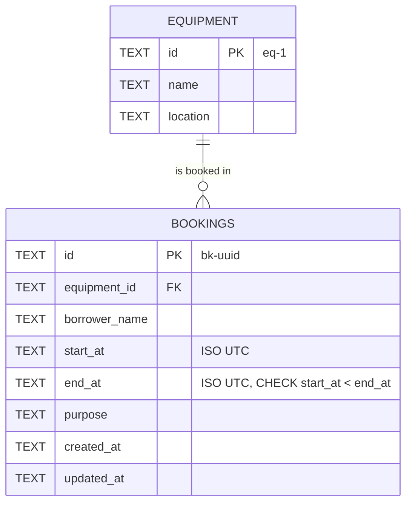

# Campus Equipment Booking API

TypeScript + Hono on Cloudflare Workers runtime, with local D1 (SQLite) via `wrangler`.

**Base API URL used for testing:**
- Local: `http://localhost:8787/api`
- Deployed (Cloudflare Workers + remote D1): `https://equipment-booking-api.nitiphumhon.workers.dev/api`

## Run

```bash
npm install
npm run db:init     # create tables + seed equipment in local D1 (safe to re-run)
npm run dev         # starts http://localhost:8787
```

On Windows PowerShell, if `npm`/`npx` are blocked by the script execution policy, use `npm.cmd` / `npx.cmd` instead. Tests use bash (Git Bash).

Quick check:

```bash
curl -s http://localhost:8787/api/equipment
```

Deploy to Cloudflare (after `npx wrangler login`; D1 `booking-db` already created, id in `wrangler.jsonc`):

```bash
npm run db:init:remote   # create tables + seed equipment in remote D1
npm run deploy
```

Contract: see [API_CONTRACT.md](API_CONTRACT.md).

## Schema / ERD



One equipment has many bookings (1:N). Full DDL: [schema.sql](schema.sql).

## Testing (curl)

```bash
bash tests/curl_tests.sh http://localhost:8787/api evidence/local_results.md
bash tests/curl_tests.sh https://equipment-booking-api.nitiphumhon.workers.dev/api evidence/deployed_results.md
```

Cases G1–G9 follow `curl_test_guide.md`; E1–E9 are extra edge/error cases. Full requests and responses: [evidence/local_results.md](evidence/local_results.md), [evidence/deployed_results.md](evidence/deployed_results.md). Result: **18/18 passed on both local and deployed**.

| Case | Description | Expected |
|---|---|---:|
| G1 | List equipment | 200 |
| G2 | List bookings | 200 |
| G3 | Create a booking | 201 |
| G4 | Get one booking | 200 |
| G5 | Update a booking (PATCH) | 200 |
| G6 | Invalid time range (start after end) | 400 |
| G7 | Overlapping booking (POST) | 409 |
| G8 | Missing booking | 404 |
| E1 | Back-to-back booking allowed | 201 |
| E2 | Overlap via PATCH | 409 |
| E3 | Missing required fields | 400 |
| E4 | `equipmentId` does not exist | 400 |
| E5 | Malformed JSON | 400 |
| E6 | Impossible date (Feb 30) | 400 |
| E7 | PATCH missing booking | 404 |
| G9 | Delete a booking | 204 |
| E8 | Delete same booking again | 404 |
| E9 | Clean up second booking | 204 |

## How the overlap check works

Two time ranges `[A.start, A.end)` and `[B.start, B.end)` overlap exactly when `A.start < B.end AND B.start < A.end`.

| Existing 09:00–11:00 vs new | Overlap? | Result |
|---|---|---|
| 10:00–12:00 (partial) | yes | 409 |
| 08:00–12:00 (covers) | yes | 409 |
| 09:30–10:30 (inside) | yes | 409 |
| 11:00–12:00 (touching) | no (`11:00 < 11:00` is false) | 201 |
| other equipment, same time | not compared | 201 |

- **Create:** compare against all bookings of the same `equipmentId`.
- **Update (PATCH):** merge the patch onto the stored booking, then run the same check but exclude the booking itself (`id != ?`), otherwise a booking would always conflict with its own old time.
- The check runs twice: first a `SELECT` to return a clear 409 message, then again inside the `INSERT … WHERE NOT EXISTS` / `UPDATE … AND NOT EXISTS` statement, so check-and-write is one atomic SQL statement and two concurrent requests cannot both succeed.

## Known limitations

- No authentication: anyone can edit or delete any booking.
- No pagination on `GET /bookings`.
- Equipment cannot be created/edited through the API (seed data only).

## Assumptions

1. No starter repository was provided, so the project was created from scratch with the course stack (Hono + local D1).
2. Times must be ISO 8601 with a timezone; they are normalized to UTC (`toISOString`) before storing, so string comparison in SQL is a correct time comparison.
3. Intervals are half-open `[startAt, endAt)`: a booking ending at 11:00 does not conflict with one starting at 11:00.
4. All five booking fields are required on create; `purpose` must be non-empty.
5. A nonexistent `equipmentId` in the request body returns **400** (invalid data), while a nonexistent booking id in the URL returns **404**.
6. Equipment is read-only seed data (3 items); only bookings have full CRUD.
7. No authentication and no CORS (testing uses curl, not a browser).
